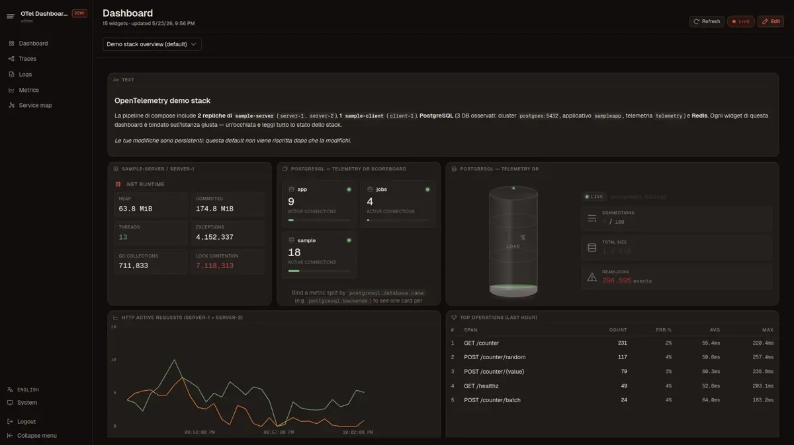

# OpenTelemetry Dashboard

> "Grafana was overwhelming, while Aspire was lacking."
>
> This dashboard is the "just right" middle ground: a lightweight, self-hosted OTLP receiver and viewer designed for those who need professional observability without the setup fatigue.



A self-hosted OTLP receiver and viewer for traces, logs, and metrics.
.NET 10 + EF Core backend, Vue 3 / Nuxt 4 SPA. Stores telemetry in SQLite,
PostgreSQL, or SQL Server. Speaks OTLP gRPC on `:4317` and OTLP
HTTP/Protobuf on `:4318` (the same port also serves the SPA).

**Live demo:** [adiakys.github.io/OtlpDashboard](https://adiakys.github.io/OtlpDashboard/) — static build with mock telemetry, no backend required. Login accepts any password (e.g. `demo`).

> The demo runs against an in-browser **mock** backend (a tiny TS shim
> that intercepts every API call and returns generated DTOs) — not the
> real .NET host. It exists to let people click around without us
> hosting anything; behaviour can drift from the real server in subtle
> ways (some flows are stubbed, some validation paths return generated
> data instead of real errors). For a faithful preview run the docker
> compose stack below.

---

## Quick start

### Docker — full demo stack

The bundled `docker-compose.yml` starts the dashboard against Postgres plus a
small demo workload (`sample-server` + `sample-client` + the OpenTelemetry
Collector) that pushes traces, logs, and metrics so the dashboard isn't empty
on first boot:

```bash
docker compose up --build
# OTLP gRPC : localhost:4317
# OTLP HTTP : localhost:4318
# SPA       : http://localhost:4318
```

Sources for the demo workload live under [`demo/`](demo/) — sample app
(Server / Client), the built-in widget-library pack
(`demo/packs/default/`, distributed as a separate repo and consumed via
git submodule), the demo-stack starter dashboard
(`demo/packs/default-dashboard/`), and the Collector config. To run only the dashboard against an external Postgres / SQL Server,
strip the demo services from your override file and point
`Dashboard__Storage__Provider` + `ConnectionStrings__*` at your DB.

### Local dev (no Docker)

```bash
# Backend
dotnet run --project src/OpenTelemetryDashboard.Host

# Frontend (separate terminal, hot-reload, proxies /api to :4318)
cd web && pnpm install && pnpm dev
```

The backend runs migrations on every boot, so the SQLite file appears at
`./src/OpenTelemetryDashboard.Host/data/telemetry.db` on first run.

---

## Configuration

All settings live under `Dashboard:*` in `appsettings.json` and can be
overridden by environment variables using double underscores
(e.g. `Dashboard__BrowserToken`).

### Auth tokens

Two static bearer tokens gate the surface:

| Variable                       | Protects                                          |
|--------------------------------|---------------------------------------------------|
| `DASHBOARD__BROWSERTOKEN`      | The SPA + read API (`/api/v1/...`) + MCP (`/mcp`) |
| `DASHBOARD__OTLP__APIKEY`      | OTLP ingestion (gRPC + HTTP)                      |

**Auth is opt-in per surface, identically in Development and Production:**

- Set a token → that surface requires it.
- Leave a token empty → that surface is public (allow-all). Leaving
  `DASHBOARD__BROWSERTOKEN` empty also makes the SPA skip the login screen
  (`/api/v1/info` reports `requireAuth: false`), so the dashboard opens
  straight away — convenient for a local Docker / Docker Compose run.

Either unset token surfaces as `Degraded` on `/healthz` (in any
environment) and is logged at startup, so an open deployment is visible
rather than silent.

The SPA's `/login` form exchanges the password for an HttpOnly +
SameSite=Strict session cookie via `POST /api/v1/auth/login`; JS never
sees the token after the exchange. `POST /api/v1/auth/logout` clears
the cookie. OTLP clients send the API key as
`Authorization: Bearer <token>` or as the `x-otlp-api-key` header.

### Retention (max days)

Background job that drops rows older than the configured age. Defaults
target a "debug + recent forensics" workload — logs hold a month so
last-week incidents stay investigable; traces and metrics rotate
weekly because high-cardinality spans and split-by metric attributes
inflate fast.

```jsonc
"Dashboard": {
  "TelemetryLimits": {
    "MaxLogDays": 30,    // default
    "MaxTraceDays": 7,   // default
    "MaxMetricDays": 7,  // default
    "SweepIntervalMinutes": 60
  }
}
```

Or via env vars:

```bash
Dashboard__TelemetryLimits__MaxLogDays=30
Dashboard__TelemetryLimits__MaxTraceDays=7
Dashboard__TelemetryLimits__MaxMetricDays=7
Dashboard__TelemetryLimits__SweepIntervalMinutes=60
```

A value of `0` disables retention for that signal (records are kept
indefinitely) — `/healthz` then reports `Degraded` so an unbounded
window can't hide silently. The sweep runs each `SweepIntervalMinutes`
per signal independently — a failure on one kind doesn't stop the
others.

### Storage provider

```bash
Dashboard__Storage__Provider=Sqlite        # default
ConnectionStrings__Sqlite="Data Source=/app/data/telemetry.db"

Dashboard__Storage__Provider=PostgreSql
ConnectionStrings__PostgreSql="Host=...;Database=telemetry;Username=...;Password=..."

Dashboard__Storage__Provider=SqlServer
ConnectionStrings__SqlServer="Server=...;Database=telemetry;User Id=...;Password=...;TrustServerCertificate=True"
```

---

## MCP server (read-only)

An optional [Model Context Protocol](https://modelcontextprotocol.io) server
exposes the same data as the read API (logs, traces, metrics) so an LLM
client — Claude Code, Claude Desktop, MCP Inspector, etc. — can query the
dashboard directly. **Disabled by default**; set the flag to mount it:

```bash
Dashboard__Mcp__Enabled=true
```

Mounted at `/mcp` on the same port as the SPA (`:4318`) over Streamable HTTP,
gated by the same browser bearer token (`DASHBOARD__BROWSERTOKEN`) that
protects `/api/v1/*`. Tools exposed:

| Tool                  | Mirrors                                |
|-----------------------|----------------------------------------|
| `query_logs`          | `GET /api/v1/logs`                     |
| `list_log_services`   | `GET /api/v1/logs/services`            |
| `query_traces`        | `GET /api/v1/traces`                   |
| `get_trace`           | `GET /api/v1/traces/{traceId}`         |
| `list_trace_services` | `GET /api/v1/traces/services`          |
| `list_metrics`        | `GET /api/v1/metrics`                  |
| `query_metric_points` | `GET /api/v1/metrics/points`           |
| `list_metric_services`| `GET /api/v1/metrics/services`         |

Wire it into Claude Code by dropping a `.mcp.json` at your project root:

```json
{
  "mcpServers": {
    "otel-dashboard": {
      "type": "http",
      "url": "http://localhost:4318/mcp",
      "headers": { "Authorization": "Bearer ${DASHBOARD_BROWSER_TOKEN}" }
    }
  }
}
```

Built on the official `ModelContextProtocol.AspNetCore` SDK
(jointly maintained by Anthropic and Microsoft).

---

## Widgets

Dashboards are made of widgets dropped onto a 12-column grid. Three sources:

- **`std`** — built into the bundle (Stat, Line, Sparkline, Gauge, Bar gauge,
  Pie, Heatmap, Recent traces, Top traces, Logs stream, Text).
- **`custom`** — preset of a builtin saved by the user, persisted in the DB.
- **`<library>`** — read-only widgets shipped by an installed library
  (filesystem or installed from a Git repo).

The picker dialog (`+ Add widget` while editing a dashboard) shows all
three groups in the same modal. The search box filters by name,
description, *or* source — type `std`, `custom`, or a library id to filter
a whole bucket.

### Creating a custom widget

1. Open a dashboard, click **Edit**, add a builtin widget.
2. Configure it (metric binding, thresholds, range, …).
3. In the config drawer click **Save as widget**, give it a name, icon, and
   default size.

It now appears in the picker under **My widgets**, with inline edit and
delete buttons that show on hover.

Notes:
- The seed config is captured *at save time* — editing the template later
  changes only metadata (name, description, icon, default size). The seed
  config is immutable; clone + delete to change it.
- Existing dashboard instances of a deleted custom widget render a
  placeholder, not a crash.

### Packs (widget libraries + dashboards)

Everything that can ship with the dashboard — widget libraries, built-in
dashboards, and any future asset type — is distributed as a **pack**: a
single directory with `pack.json` at its root. The dashboard scans every
entry in `Dashboard:Packs:Paths` (in order) and surfaces every pack's
contents in the picker (libraries) and dashboard list (built-ins).

The shipped image already configures **two paths** in scan order:

1. `/app/data/packs` — runtime-managed (volume, git installs,
   drag-and-drop)
2. `/app/builtin-packs` — baked into the image layer (no volume
   shadowing on rebuild)

Derived images don't need to set any environment variable — just `COPY`
into the second path:

```dockerfile
FROM opentelemetrydashboard:latest
COPY my-pack/ /app/builtin-packs/my-pack/
```

When two paths expose packs with the same `pack.json#id`, the first in
scan order wins and the rest are skipped with a warning — so a runtime
install can override a baked-in default by sharing its id.

Two sample packs live under `demo/packs/`:
- `default/` (a submodule pointing at `Adiakys/OtlpDashboard-default-pack`)
  ships the .NET and PostgreSQL widget libraries.
- `default-dashboard/` ships the starter dashboard pre-bound to the
  demo compose stack.

Both are bind-mounted by `docker-compose.yml`, so `docker compose up --build`
shows libraries + starter dashboard out of the box.

Install one of two ways:

1. **Drop a folder.** Copy the pack into the packs path (volume-mount,
   Ansible, etc.). Click the refresh icon in the widget picker (or
   `POST /api/v1/packs/reload`) to re-scan.
2. **Install from a Git repo.** Click the git-branch icon in the picker
   header (or `POST /api/v1/packs/install` with `{ url, ref, path? }`).
   The server runs a shallow clone via LibGit2Sharp, parses `pack.json`,
   resolves HEAD to a commit SHA, and atomically moves the directory
   into the runtime-managed root. Allowed hosts are
   `Dashboard:Packs:AllowedGitHosts` (default `github.com, gitlab.com`).
   Use a tag for stable pinning; branches work but get a UI warning.
   The optional `path` parameter re-roots the install on a sub-directory,
   useful for monorepos that ship multiple packs side by side. Updates:
   the "Update" button on git-installed packs re-pulls the same ref
   (`fetch && reset --hard`).

#### Pack layout

```
my-pack/
├── pack.json
├── README.md            (optional — surfaced in the UI)
├── LICENSE              (optional)
├── libraries/
│   ├── core/
│   │   ├── manifest.json
│   │   └── widgets/
│   │       ├── sla-tracker/widget.json
│   │       └── trace-heatmap/widget.json
│   └── extras/
│       ├── manifest.json
│       └── widgets/…
└── dashboards/
    ├── default.json
    └── ops-overview.json
```

`pack.json`:

```json
{
  "id": "team-otel-pack",
  "name": "Team OTel Pack",
  "version": "1.2.0",
  "author": "platform@example.com",
  "license": "MIT",
  "description": "Curated widgets and dashboards for service ownership reviews",
  "homepage": "https://github.com/example/team-otel-pack",
  "libraries": [
    { "id": "core",   "path": "libraries/core" },
    { "id": "extras", "path": "libraries/extras" }
  ],
  "dashboards": [
    { "id": "default",      "path": "dashboards/default.json", "builtin": true },
    { "id": "ops-overview", "path": "dashboards/ops-overview.json" }
  ]
}
```

`id` must match the directory name. Each library entry's
`manifest.json` carries only `id`, `name`, `description?`, `icon?` —
shipping metadata (version, author, license) lives at pack level.
Dashboards flagged `builtin: true` are seeded into the dashboard store
on first boot; the rest are installable templates.

#### Writing a widget

Each `widgets/<kindId>/widget.json` declares one widget. Two engines:

**`preset`** — wraps a builtin with a precooked config:

```json
{
  "name": "SLA Tracker",
  "description": "p99 latency with SLO thresholds",
  "icon": "i-ph-target",
  "defaultSize": { "w": 4, "h": 3 },
  "engine": "preset",
  "baseKind": "metric-stat",
  "defaultConfig": {
    "calc": "last",
    "unitKind": "ms",
    "decimals": 1,
    "thresholds": [
      { "value": 0,   "color": "#7AAA7A" },
      { "value": 200, "color": "#D9B566" },
      { "value": 500, "color": "#E27A3F" }
    ]
  }
}
```

`baseKind` is one of: `metric-stat`, `metric-line`, `metric-sparkline`,
`metric-gauge`, `metric-bar-gauge`, `metric-pie`, `metric-heatmap`,
`recent-traces`, `top-traces`, `logs-stream`, `text`. The shape of `defaultConfig`
matches the corresponding form in the SPA — copy from a working instance
(`Save as widget` produces a valid one).

**`spec`** — sandboxed HTML/SVG/CSS template with named metric bindings.
Use this for card-style UIs that the standard chart widgets can't
express: a database illustration whose fill level tracks a load
metric, a grid of service tiles whose colour follows a per-service
status metric, gauges with custom artwork, etc.

```json
{
  "name": "Database card",
  "icon": "i-ph-database",
  "defaultSize": { "w": 4, "h": 4 },
  "engine": "spec",
  "spec": {
    "template": "<div class='db'>\n  <svg>...</svg>\n  <div class='stats'>\n    <strong class='{{ thresholdClass load.value load.thresholds }}'>{{ format load.value 'percent' 0 }}</strong>\n    <span>QPS {{ format qps.value 'ops' 1 }}</span>\n  </div>\n</div>",
    "styles": ".db { display: flex; gap: 1rem; ... } .db .vellum-th-bad { color: var(--color-rust-600); }",
    "dataBindings": [
      { "name": "load", "type": "metric", "calc": "last", "unitKind": "percent",
        "thresholds": [{ "value": 0, "color": "#7AAA7A" }, { "value": 70, "color": "#D9B566" }, { "value": 90, "color": "#E27A3F" }] },
      { "name": "qps",  "type": "metric", "calc": "mean", "unitKind": "ops" }
    ]
  }
}
```

The user installing the library picks one instrument per binding
(`load`, `qps`, …) via the config drawer; the template/styles are
immutable and ship with the library.

**Template syntax** (Mustache-light, no JS evaluation):

| Construct | Meaning |
|---|---|
| `{{ name }}` / `{{ name.path }}` | Interpolate a value (HTML-escaped). |
| `{{ helper arg1 arg2 }}` | Call a whitelisted helper. |
| `{{#if expr}}…{{/if}}` | Render block when truthy. |
| `{{#each list as item}}…{{/each}}` | Loop, exposes `item` and `_index`. |

**Helpers available**: `format(value, unitKind, decimals?)`,
`percent(value, min, max)`, `thresholdColor(value, thresholds)`,
`thresholdClass(value, thresholds)` (returns `vellum-th-ok` / `-warn`
/ `-bad`), `dateAgo(timestamp)`, `pluralize(n, singular, plural)`,
`default(...values)`, comparators `eq`/`neq`/`lt`/`lte`/`gt`/`gte`
(usable inside `{{#if}}`).

**Binding shapes** the template scope sees:

- `metric` (default — `splitBy` not set): `{ value, unit, unitKind, thresholds }`.
- `metric` with `splitBy: "service.name"`: array of `{ key, value, attrs, thresholds }` — iterable with `{{#each}}`.
- `metric-series`: array of raw `{ time, value, attributes }` rows.

**Sandboxing**:

- The Mustache renderer never `eval`s — only whitelisted helpers run.
- DOMPurify (lazy-loaded ~50 KB gzip) sanitises the rendered HTML:
  no `<script>`, no `on*=`, no `javascript:` URLs, no `<iframe>`.
- CSS is auto-prefixed with the widget's instance scope so styles
  can't leak; `@import`, `@font-face`, `expression()`, and IE-era
  binding tricks are stripped before scoping.

Field rules enforced by the loader (`engine: spec`):

- `name` ≤ 64 chars.
- `description` ≤ 280 chars.
- `icon` matches `^i-(ph|lucide)-[a-z0-9-]+$`.
- `defaultSize.w` ∈ [1, 12], `defaultSize.h` ∈ [1, 24].
- `defaultConfig` ≤ 64 KiB; `spec` (the whole template+styles+bindings
  envelope) ≤ 256 KiB.

Invalid widgets are skipped (logged) and don't break the rest of the
library.

The bundled `demo/packs/default/libraries/postgres/` library ships
`postgres-server-card` and `db-scoreboard` — two `engine: spec` widgets
that double as live examples for authors of the `spec` engine.

---

## Built-in dashboards

Dashboards ship inside packs — list them in `pack.json#dashboards` with
`builtin: true` and the `BuiltinDashboardSeeder` folds each into the
dashboard store on the first boot after install. The format matches the
one the SPA emits via "Export JSON".

### File format

Same envelope produced by the SPA's export, plus an optional top-level
`id`:

```json
{
  "version": 1,
  "id": "00000000-0000-0000-0000-000000000001",
  "name": "Production Overview",
  "widgets": [
    { "id": "...", "kind": "std:metric-stat", "x": 0, "y": 0, "w": 4, "h": 3, "config": { /* opaque */ } }
  ]
}
```

### Id resolution (precedence)

1. **Explicit `id`** in the JSON wins, must parse as a Guid.
2. **`default.json`** filename → `00000000-0000-0000-0000-000000000001`
   (the well-known default dashboard id). Convenient for distributing a
   non-empty default.
3. **Any other filename** → SHA-256 of the filename, truncated to 16
   bytes (RFC 9562 v8). Stable across deployments — same filename
   always produces the same dashboard id.

### Idempotency

The seeder runs every boot but uses **skip-if-exists** semantics: an id
already in the store is left alone. The single special case is the
default dashboard — when `default.json` is present and the existing
default row is still pristine (no widgets, RowVersion 0), the seeder
upserts it once. Any user edit (saved widgets or RowVersion ≥ 1) makes
the seeder back off.

To re-apply a built-in file, delete the dashboard via the UI first.

A demo lives at `demo/packs/default-dashboard/dashboards/default.json`
(referenced from `default-dashboard/pack.json` with `builtin: true`),
mounted by `docker-compose.yml` as `/app/builtin-packs/default-dashboard`.

---

## Endpoints

| Method | Path                                  | Purpose                       |
|--------|---------------------------------------|-------------------------------|
| GET    | `/healthz`                            | Liveness + readiness probe (anonymous; checks DB, sink, retention, auth posture) |
| POST   | `/v1/{traces,logs,metrics}`           | OTLP HTTP/Protobuf ingestion  |
| POST   | `/api/v1/auth/login`, `/logout`       | Session-cookie login / logout (anonymous) |
| GET    | `/api/v1/info`                        | App name (anonymous); version + retention + storage provider when authenticated |
| GET    | `/api/v1/traces`, `/logs`, `/metrics` | Query API (paginated). `/metrics/points` requires `from`/`to` |
| GET/POST/PUT/DELETE | `/api/v1/dashboards`     | Dashboards CRUD. `DELETE` requires `?rowVersion=N` (optimistic concurrency) |
| GET/POST/PUT/DELETE | `/api/v1/widgets/definitions` | Custom widgets CRUD. `DELETE` requires `?rowVersion=N` |
| GET    | `/api/v1/widgets/libraries`           | Flat library list for the picker |
| GET    | `/api/v1/packs`                       | Installed packs (libraries + dashboards) |
| POST   | `/api/v1/packs/reload`                | Re-scan the packs paths       |
| POST   | `/api/v1/packs/install`               | Clone from git (`{url,ref,path?}`) |
| POST   | `/api/v1/packs/{id}/update`           | Re-pull a git-installed pack  |
| DELETE | `/api/v1/packs/{id}`                  | Uninstall a pack              |
| POST/GET/DELETE | `/mcp`                       | MCP server (when `Dashboard:Mcp:Enabled`) |
| (boot) | seed dashboards from packs            | `builtin: true` dashboards loaded after migrations, idempotent |

Errors return RFC 7807 `application/problem+json` with a `traceId`
extension for log correlation. Per-IP rate limits apply to OTLP ingest
(200 req/s default), the read API (60 req/s), mutations (10 req/s),
and pack install (1 concurrent globally) — tunable under
`Dashboard:RateLimits:*`.

---

## Acknowledgements

Claude Code did a lot of the typing on this project. The direction, design,
testing, and debugging stayed on me.

---

## License

[GPLv3](LICENSE).
